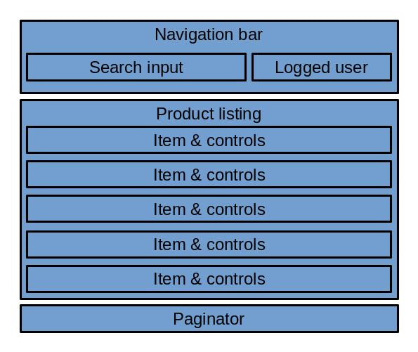

# Experiment to compare redux with pinia

Small experiment to see how achieve same result using pure vue, vue with pinia
and react with redux.

## The components



I want a certain set of behaviors here:

1. Login/logoff resets the filter and paginator.
1. Filter changes resets the paginator.
1. Each named element is a distinct component.

## Observed results

I've added a store-less vue version to use as benchmark. The extra complexity
and tight coupling are alarming.

React in 2022 isn't the same as 2018. This is why i might add a second react
example using redux toolkit instead just plain old redux.

You can't call other actions inside reducers on redux. Pinia has no issues with
that. It means that some events become more verbose on the component side. Take
the NavBar implementation for comparison:

```html
<template>
  <div>
    <input v-model="query" @keyup="filterStore.updateQuery(query)" />
    <button @click="userStore.setLogged(!userStore.logged)">
      {{ userStore.logged ? "Logout" : "Login" }}
    </button>
  </div>
</template>

<script setup>
import { ref } from "vue";
import { useUser, useFilter } from "../store";
const userStore = useUser();
const filterStore = useFilter();
const query = ref(filterStore.query);
</script>

<style></style>
```

```jsx
import { useSelector, useDispatch } from 'react-redux'

import { productActions, filterActions, userActions } from '../store'

export default function NavBar(props) {
  const userState = useSelector(state => state.userReducer)
  const filter = useSelector(state => state.filterReducer)
  const dispatch = useDispatch()

  const queryProducts = (e) => {
    dispatch(productActions.queryProducts(e.target.value))
    dispatch(filterActions.setQuery(e.target.value))
    dispatch(filterActions.setPage(1))
  }

  return <div>
    <input value={filter.query} onChange={queryProducts} />
    <button onClick={() => dispatch(userActions.setLogged(!userState.logged))}>
      {userState.logged ? 'Logout' : 'Login'}
    </button>
  </div>
}
```

## Conclusion

Pinia is dead simple to configure and components relying on it are much simper
to maintain.
